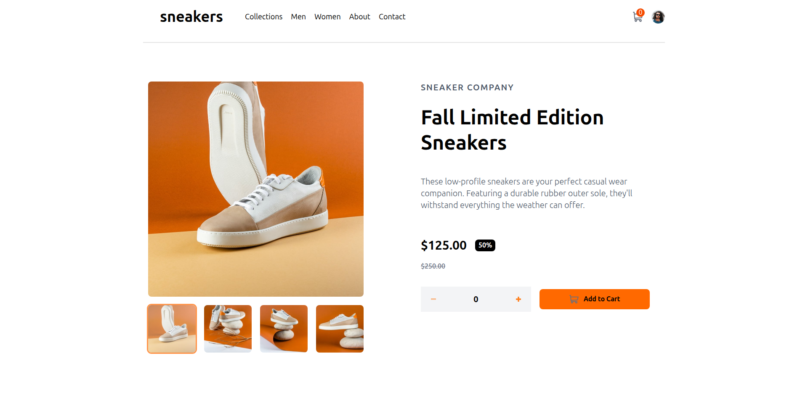
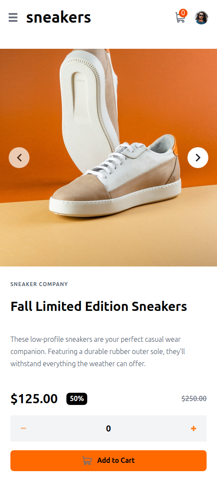

# E-commerce Product Page

Responsive e-commerce product page built with React, TypeScript and TailwindCSS.  
This project was developed as a solution to a Frontend Mentor challenge, focused on responsive layouts and interactive user experience.

---

## Live Demo

🔗 https://ecommerce-product-page-u9n1.vercel.app/

---

## Preview

### Desktop



### Mobile

<p align="center">
  
</p>

---

## Technologies

- React
- TypeScript
- TailwindCSS
- Vite

---

## Features

- Responsive layout for mobile and desktop
- Product image slider
- Lightbox product gallery
- Shopping cart functionality
- Quantity selector
- Interactive mobile navigation menu
- Dynamic cart updates
- Product thumbnail preview

---

## Challenge

This project was built as a solution to a Frontend Mentor challenge.

Challenge link:  
https://www.frontendmentor.io/challenges/ecommerce-product-page-UPsZ9MJp6

---

## What I Learned

During this project I practiced and improved:

- React state management with `useState`
- Component-based architecture
- Responsive UI development
- Conditional rendering
- Event handling in React
- TailwindCSS utility-first workflow
- TypeScript props typing
- Interactive UI behaviors

---

## Future Improvements

- Persist cart data with localStorage
- Improve accessibility
- Add keyboard navigation support
- Add smooth animations and transitions
- Refactor repeated UI logic into reusable components

---

## Run Locally

Clone the project:

```bash
git clone https://github.com/Edmon-Nascimento/ecommerce-product-page
```

Install dependencies:

```bash
npm install
```

Start the development server:

```bash
npm run dev
```

---

## Author

GitHub:  
https://github.com/Edmon-Nascimento

LinkedIn:  
https://www.linkedin.com/in/edmon-nascimento/

---

## Credits

Challenge by Frontend Mentor:  
https://www.frontendmentor.io/
